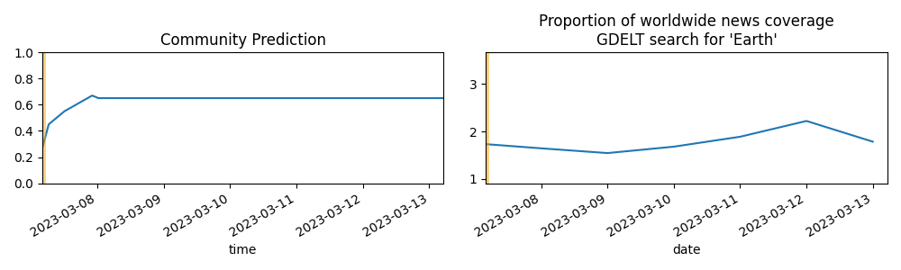
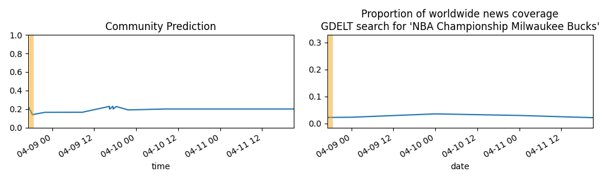
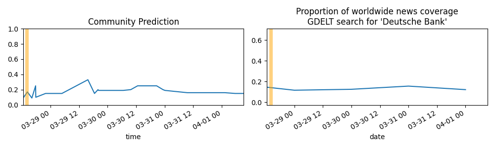

Updates About The World
=======================

Summary
=======

* [Will New York City break its record by going more than 332 days without measurable snow?](#will-new-york-city-break-its-record-by-going-more-than-332-days-without-measurable-snow)
* [Will a grant recipient of the FTX Foundation have their grant funds frozen, seized, or demanded back? (January 1, 2024)](#will-a-grant-recipient-of-the-ftx-foundation-have-their-grant-funds-frozen-seized-or-demanded-back-january-1-2024)
* [Will a grant recipient of the FTX Foundation have their grant funds frozen, seized, or demanded back? (January 1, 2027)](#will-a-grant-recipient-of-the-ftx-foundation-have-their-grant-funds-frozen-seized-or-demanded-back-january-1-2027)

# Will New York City break its record by going more than 332 days without measurable snow?

# Will a grant recipient of the FTX Foundation have their grant funds frozen, seized, or demanded back? (January 1, 2024)

# Will a grant recipient of the FTX Foundation have their grant funds frozen, seized, or demanded back? (January 1, 2027)

