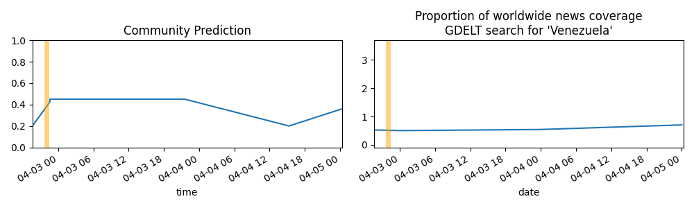

Updates About The World
=======================

Summary
=======

* [Will Russian troops reach the center of Bakhmut, Ukraine before 0000 hrs local time on January 20th, 2023?](#will-russian-troops-reach-the-center-of-bakhmut-ukraine-before-0000-hrs-local-time-on-january-20th-2023)
* [Will a grant recipient of the FTX Foundation have their grant funds frozen, seized, or demanded back? (January 1, 2024)](#will-a-grant-recipient-of-the-ftx-foundation-have-their-grant-funds-frozen-seized-or-demanded-back-january-1-2024)
* [Will Russian troops reach the center of Bakhmut, Ukraine before 0000 hrs local time on January 27th, 2023?](#will-russian-troops-reach-the-center-of-bakhmut-ukraine-before-0000-hrs-local-time-on-january-27th-2023)
* [Will a grant recipient of the FTX Foundation have their grant funds frozen, seized, or demanded back? (January 1, 2027)](#will-a-grant-recipient-of-the-ftx-foundation-have-their-grant-funds-frozen-seized-or-demanded-back-january-1-2027)
* [Which teams will advance to the divisional round of the 2023 NFL playoffs? (Jacksonville Jaguars)](#which-teams-will-advance-to-the-divisional-round-of-the-2023-nfl-playoffs-jacksonville-jaguars)

# Will Russian troops reach the center of Bakhmut, Ukraine before 0000 hrs local time on January 20th, 2023?

# Will a grant recipient of the FTX Foundation have their grant funds frozen, seized, or demanded back? (January 1, 2024)

# Will Russian troops reach the center of Bakhmut, Ukraine before 0000 hrs local time on January 27th, 2023?

# Will a grant recipient of the FTX Foundation have their grant funds frozen, seized, or demanded back? (January 1, 2027)

# Which teams will advance to the divisional round of the 2023 NFL playoffs? (Jacksonville Jaguars)

