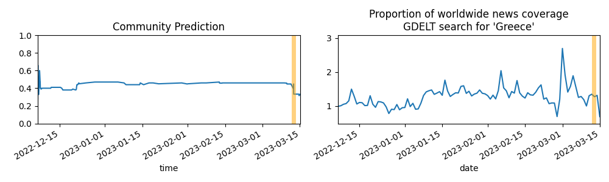

Updates About The World
=======================

Summary
=======

* [Will New York City break its record by going more than 332 days without measurable snow?](#will-new-york-city-break-its-record-by-going-more-than-332-days-without-measurable-snow)
* [Will the Democratic Progressive Party (DPP) win the 2024 presidential election in Taiwan?](#will-the-democratic-progressive-party-dpp-win-the-2024-presidential-election-in-taiwan)
* [Will Russian troops reach the center of Bakhmut, Ukraine before 0000 hrs local time on January 27th, 2023?](#will-russian-troops-reach-the-center-of-bakhmut-ukraine-before-0000-hrs-local-time-on-january-27th-2023)
* [Will a grant recipient of the FTX Foundation have their grant funds frozen, seized, or demanded back? (January 1, 2024)](#will-a-grant-recipient-of-the-ftx-foundation-have-their-grant-funds-frozen-seized-or-demanded-back-january-1-2024)

# Will New York City break its record by going more than 332 days without measurable snow?

# Will the Democratic Progressive Party (DPP) win the 2024 presidential election in Taiwan?

# Will Russian troops reach the center of Bakhmut, Ukraine before 0000 hrs local time on January 27th, 2023?

# Will a grant recipient of the FTX Foundation have their grant funds frozen, seized, or demanded back? (January 1, 2024)

