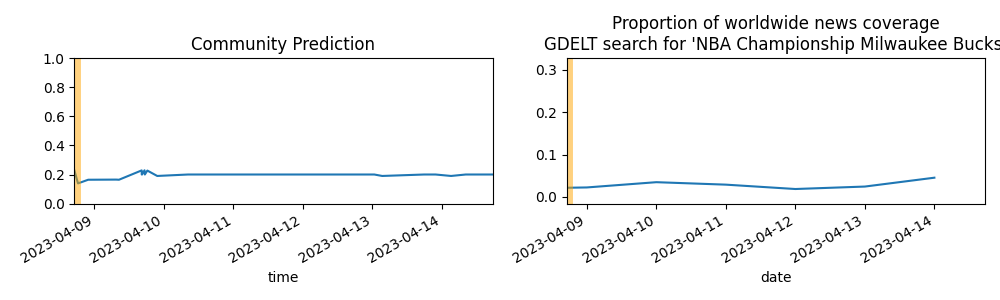

Updates About The World
=======================

Summary
=======

* [Will New York City break its record by going more than 332 days without measurable snow?](#will-new-york-city-break-its-record-by-going-more-than-332-days-without-measurable-snow)
* [Will Russian troops reach the center of Bakhmut, Ukraine before 0000 hrs local time on January 27th, 2023?](#will-russian-troops-reach-the-center-of-bakhmut-ukraine-before-0000-hrs-local-time-on-january-27th-2023)
* [Will a grant recipient of the FTX Foundation have their grant funds frozen, seized, or demanded back? (January 1, 2024)](#will-a-grant-recipient-of-the-ftx-foundation-have-their-grant-funds-frozen-seized-or-demanded-back-january-1-2024)
* [Will a grant recipient of the FTX Foundation have their grant funds frozen, seized, or demanded back? (January 1, 2027)](#will-a-grant-recipient-of-the-ftx-foundation-have-their-grant-funds-frozen-seized-or-demanded-back-january-1-2027)
* [What coalition will govern Berlin after the 2023 repeat state election? (SPD+Greens+Left)](#what-coalition-will-govern-berlin-after-the-2023-repeat-state-election-spdgreensleft)
* [In 2023 will there be more than 25 million confirmed COVID cases in China?](#in-2023-will-there-be-more-than-25-million-confirmed-covid-cases-in-china)
* [Who will win the 2023 Nigerian Presidential Election? (Bola Tinubu)](#who-will-win-the-2023-nigerian-presidential-election-bola-tinubu)

# Will New York City break its record by going more than 332 days without measurable snow?

# Will Russian troops reach the center of Bakhmut, Ukraine before 0000 hrs local time on January 27th, 2023?

# Will a grant recipient of the FTX Foundation have their grant funds frozen, seized, or demanded back? (January 1, 2024)

# Will a grant recipient of the FTX Foundation have their grant funds frozen, seized, or demanded back? (January 1, 2027)

# What coalition will govern Berlin after the 2023 repeat state election? (SPD+Greens+Left)

# In 2023 will there be more than 25 million confirmed COVID cases in China?

# Who will win the 2023 Nigerian Presidential Election? (Bola Tinubu)

