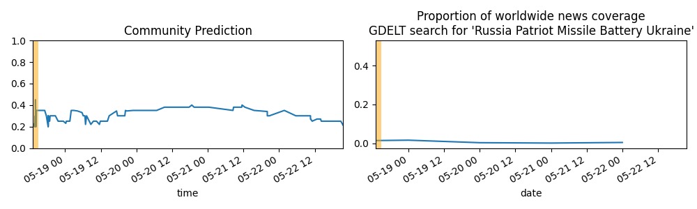

Updates About The World
=======================

Summary
=======

* [[Short Fuse] Will the total credit extended through all Fed liquidity facilities exceed $500 billion for any week before May 2023?](#short-fuse-will-the-total-credit-extended-through-all-fed-liquidity-facilities-exceed-500-billion-for-any-week-before-may-2023)
* [Will Emmanuel Macron cease being President of France before 2027?](#will-emmanuel-macron-cease-being-president-of-france-before-2027)
* [Will there be a driver fatality in the NASCAR Cup Series before 2050?](#will-there-be-a-driver-fatality-in-the-nascar-cup-series-before-2050)
* [Will Deutsche Bank collapse (or be rescued) before June 2023?](#will-deutsche-bank-collapse-or-be-rescued-before-june-2023)

# [Short Fuse] Will the total credit extended through all Fed liquidity facilities exceed $500 billion for any week before May 2023?

# Will Emmanuel Macron cease being President of France before 2027?

# Will there be a driver fatality in the NASCAR Cup Series before 2050?

# Will Deutsche Bank collapse (or be rescued) before June 2023?

