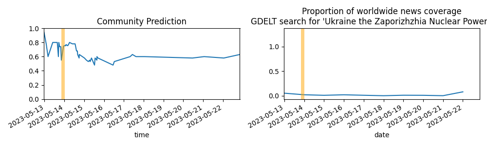

Updates About The World
=======================

Summary
=======

* [Will Donald Trump be found guilty of any crime in the Manhattan case before Election Day 2024?](#will-donald-trump-be-found-guilty-of-any-crime-in-the-manhattan-case-before-election-day-2024)
* [Will FDA approval of mifepristone for abortion no longer be in effect for any period of time before July 1, 2023?](#will-fda-approval-of-mifepristone-for-abortion-no-longer-be-in-effect-for-any-period-of-time-before-july-1-2023)
* [Will Santiago Peña win the Paraguayan presidential election on April 30th?](#will-santiago-pea-win-the-paraguayan-presidential-election-on-april-30th)

# Will Donald Trump be found guilty of any crime in the Manhattan case before Election Day 2024?

# Will FDA approval of mifepristone for abortion no longer be in effect for any period of time before July 1, 2023?

# Will Santiago Peña win the Paraguayan presidential election on April 30th?

