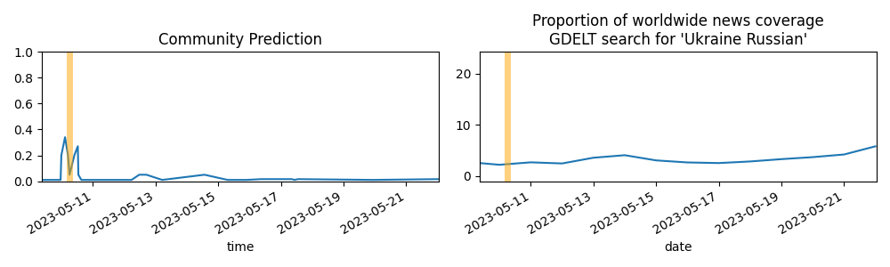

Updates About The World
=======================

Summary
=======

* [Will Ukraine be confirmed to have used chemical weapons against Russian forces by January 1, 2024?](#will-ukraine-be-confirmed-to-have-used-chemical-weapons-against-russian-forces-by-january-1-2024)
* [Will Russia substantially damage or destroy a Patriot Missile Battery in Ukraine before July, 2023?](#will-russia-substantially-damage-or-destroy-a-patriot-missile-battery-in-ukraine-before-july-2023)
* [Will the Palme d'Or, the top prize at the 2023 Cannes Film Festival, be awarded to a film from a European country?](#will-the-palme-dor-the-top-prize-at-the-2023-cannes-film-festival-be-awarded-to-a-film-from-a-european-country)
* [Will Ukraine regain control of the Zaporizhzhia Nuclear Power Plant before January 1, 2024?](#will-ukraine-regain-control-of-the-zaporizhzhia-nuclear-power-plant-before-january-1-2024)
* [Will Estonia legalize gay marriage in 2023?](#will-estonia-legalize-gay-marriage-in-2023)

# Will Ukraine be confirmed to have used chemical weapons against Russian forces by January 1, 2024?

# Will Russia substantially damage or destroy a Patriot Missile Battery in Ukraine before July, 2023?

# Will the Palme d'Or, the top prize at the 2023 Cannes Film Festival, be awarded to a film from a European country?

# Will Ukraine regain control of the Zaporizhzhia Nuclear Power Plant before January 1, 2024?

# Will Estonia legalize gay marriage in 2023?

