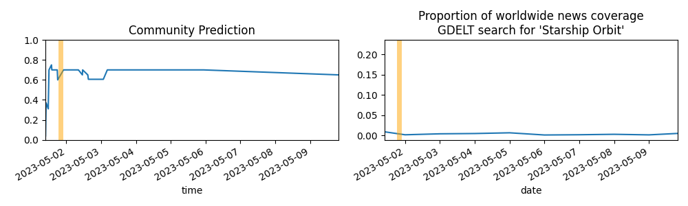

Updates About The World
=======================

Questions
=========

* [Will the Universe end?](#will-the-universe-end)
* [A decrease in US meat production by 2025](#a-decrease-in-us-meat-production-by-2025)
* [SpaceX Lands People on Mars by 2030](#spacex-lands-people-on-mars-by-2030)
* [Someone Born before 2001 Lives to 150](#someone-born-before-2001-lives-to-150)
* [Brain Emulation Produces First Human AI](#brain-emulation-produces-first-human-ai)
* [Major State Exits EU before 2027](#major-state-exits-eu-before-2027)
* [Human/Machine Intelligence Parity by 2040](#humanmachine-intelligence-parity-by-2040)
* [Robocup Challenge Completed by 2050](#robocup-challenge-completed-by-2050)

# Will the Universe end?

# A decrease in US meat production by 2025

# SpaceX Lands People on Mars by 2030

# Someone Born before 2001 Lives to 150

# Brain Emulation Produces First Human AI

# Major State Exits EU before 2027

# Human/Machine Intelligence Parity by 2040

# Robocup Challenge Completed by 2050

