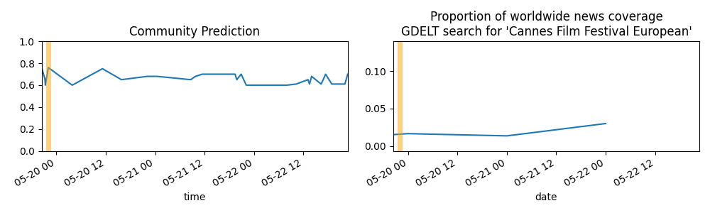

Updates About The World
=======================

Summary
=======

* [Will OpenAI release a public API for programmatically querying ChatGPT before April 1, 2023?](#will-openai-release-a-public-api-for-programmatically-querying-chatgpt-before-april-1-2023)
* [Will Russia capture or surround a large Ukrainian city before June 1, 2023?](#will-russia-capture-or-surround-a-large-ukrainian-city-before-june-1-2023)
* [Will Israel have a national election for Knesset in 2023?](#will-israel-have-a-national-election-for-knesset-in-2023)
* [Will Microsoft integrate Large Language Model responses directly into Bing Search before September 30, 2023?](#will-microsoft-integrate-large-language-model-responses-directly-into-bing-search-before-september-30-2023)
* [Will OpenAI's ChatGPT be available for free public use on Jan 31, 2023?](#will-openais-chatgpt-be-available-for-free-public-use-on-jan-31-2023)
* [Will Russia start another wave of mobilization before the following dates? (March 1, 2023)](#will-russia-start-another-wave-of-mobilization-before-the-following-dates-march-1-2023)

# Will OpenAI release a public API for programmatically querying ChatGPT before April 1, 2023?

# Will Russia capture or surround a large Ukrainian city before June 1, 2023?

# Will Israel have a national election for Knesset in 2023?

# Will Microsoft integrate Large Language Model responses directly into Bing Search before September 30, 2023?

# Will OpenAI's ChatGPT be available for free public use on Jan 31, 2023?

# Will Russia start another wave of mobilization before the following dates? (March 1, 2023)

