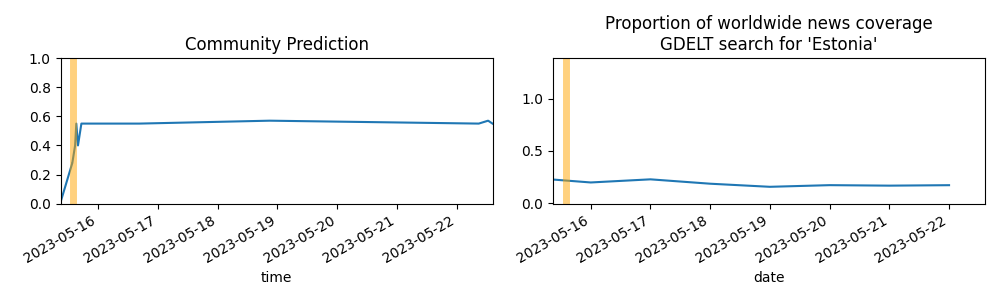

Updates About The World
=======================

Summary
=======

* [SpaceX Starship Orbit in 2023? (Yes) → SpaceX Mars Mission by 2030?](#spacex-starship-orbit-in-2023-yes--spacex-mars-mission-by-2030)
* [SpaceX Starship Orbit in 2023? (No) → SpaceX Mars Mission by 2030?](#spacex-starship-orbit-in-2023-no--spacex-mars-mission-by-2030)
* [Will Ukraine be confirmed to have used chemical weapons against Russian forces by January 1, 2024?](#will-ukraine-be-confirmed-to-have-used-chemical-weapons-against-russian-forces-by-january-1-2024)
* [Will China engage in a full-scale blockade against Taiwan before the following years? (2025)](#will-china-engage-in-a-full-scale-blockade-against-taiwan-before-the-following-years-2025)

# SpaceX Starship Orbit in 2023? (Yes) → SpaceX Mars Mission by 2030?

# SpaceX Starship Orbit in 2023? (No) → SpaceX Mars Mission by 2030?

# Will Ukraine be confirmed to have used chemical weapons against Russian forces by January 1, 2024?

# Will China engage in a full-scale blockade against Taiwan before the following years? (2025)

