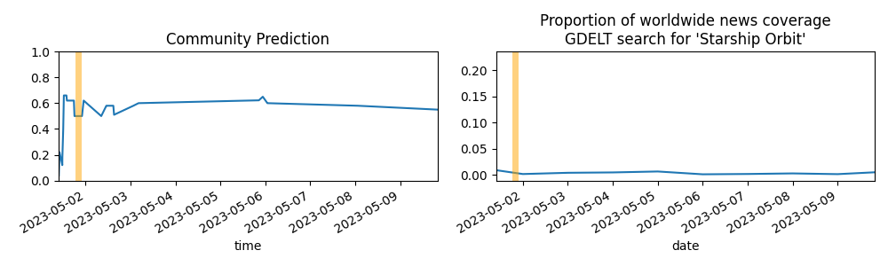

Updates About The World
=======================

Summary
=======

* [[Short Fuse] Will the total credit extended through all Fed liquidity facilities exceed $500 billion for any week before May 2023?](#short-fuse-will-the-total-credit-extended-through-all-fed-liquidity-facilities-exceed-500-billion-for-any-week-before-may-2023)
* [Will certain marble statues removed from Greece in the early 19th century be moved back before 2024?](#will-certain-marble-statues-removed-from-greece-in-the-early-19th-century-be-moved-back-before-2024)
* [Will First Republic Bank enter FDIC receivership or be sold "under duress" before January 1, 2024?](#will-first-republic-bank-enter-fdic-receivership-or-be-sold-under-duress-before-january-1-2024)
* [Will there be an exponential improvement in the bounds on diagonal Ramsey by 2060?](#will-there-be-an-exponential-improvement-in-the-bounds-on-diagonal-ramsey-by-2060)
* [Will there be a driver fatality in the NASCAR Cup Series before 2050?](#will-there-be-a-driver-fatality-in-the-nascar-cup-series-before-2050)

# [Short Fuse] Will the total credit extended through all Fed liquidity facilities exceed $500 billion for any week before May 2023?

# Will certain marble statues removed from Greece in the early 19th century be moved back before 2024?

# Will First Republic Bank enter FDIC receivership or be sold "under duress" before January 1, 2024?

# Will there be an exponential improvement in the bounds on diagonal Ramsey by 2060?

# Will there be a driver fatality in the NASCAR Cup Series before 2050?

