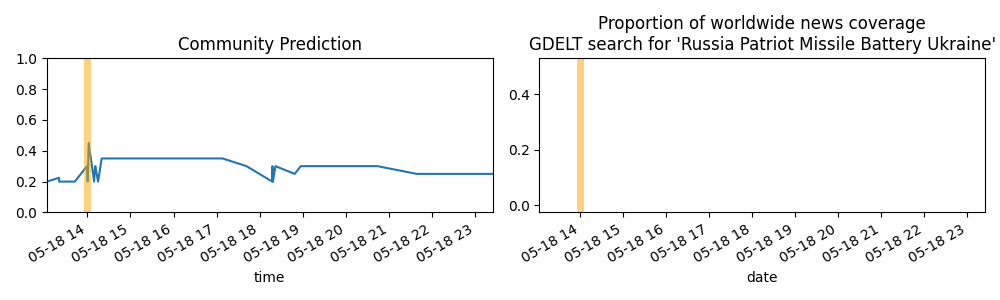

Updates About The World
=======================

Summary
=======

* [Will the maiden flight of the H3 Launch Vehicle carrying ALOS-3 launch successfully and on time?](#will-the-maiden-flight-of-the-h3-launch-vehicle-carrying-alos-3-launch-successfully-and-on-time)
* [Who will win the 2023 Presidential Election in Türkiye (Turkey)? (Kemal Kılıçdaroğlu)](#who-will-win-the-2023-presidential-election-in-trkiye-turkey-kemal-kldarolu)
* [Will the maiden flight of the H3 Launch Vehicle carrying ALOS-3 launch successfully and on time?](#will-the-maiden-flight-of-the-h3-launch-vehicle-carrying-alos-3-launch-successfully-and-on-time)
* [Will the Ukrainian parliamentary elections be held on schedule on or before 29 October, 2023?](#will-the-ukrainian-parliamentary-elections-be-held-on-schedule-on-or-before-29-october-2023)
* [If Erdoğan loses the 2023 presidential election, will he abdicate the presidency?](#if-erdoan-loses-the-2023-presidential-election-will-he-abdicate-the-presidency)

# Will the maiden flight of the H3 Launch Vehicle carrying ALOS-3 launch successfully and on time?

# Who will win the 2023 Presidential Election in Türkiye (Turkey)? (Kemal Kılıçdaroğlu)

# Will the maiden flight of the H3 Launch Vehicle carrying ALOS-3 launch successfully and on time?

# Will the Ukrainian parliamentary elections be held on schedule on or before 29 October, 2023?

# If Erdoğan loses the 2023 presidential election, will he abdicate the presidency?

